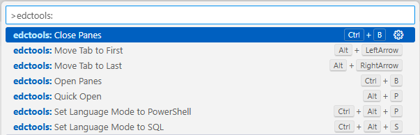

# 🧩 VS Code Extension — EdC Personal Tools

Miscellaneous productivity commands for my personal use.

---

## Features

- Single keystroke to change language mode to SQL
- Single keystroke to change language mode to Powershell
- Toggle visibility of left and bottom panels with single keystroke
- Move current tab to first or last position
- Quick open multiple files, with Ctrl-P like search

---

## Commands

| Command | Description | Key Binding |
|----------|-------------|-------------|
| `edctools: Set Language Mode to SQL` | Set editor language mode to SQL | Ctrl-Alt-S |
| `edctools: Set Language Mode to PowerShell` | Set editor language mode to Powershell | Ctrl-Alt-P |
| `edctools: Open Panes` | Open left and bottom panels | Ctrl-B when panels are closed |
| `edctools: Close Panes` | Close left and bottom panels | Ctrl-B when panels are open |
| `edctools: Move Tab to First` | Move tab to the first position | Alt-LeftArrow |
| `edctools: Move Tab to Last` | Move tab to the last position | Alt-RightArrow |
| `edctools: Quick Open` | Quick open multiple files | Alt-P |


You can access these from the Command Palette or assign keybindings via **Preferences → Keyboard Shortcuts**.

---

## Screenshot



---

## Development

Clone the repo and open it in VS Code:

```bash
git clone https://github.com/EdCallahan/VSCode-EdCTools
cd VSCode-EdCTools
code .
